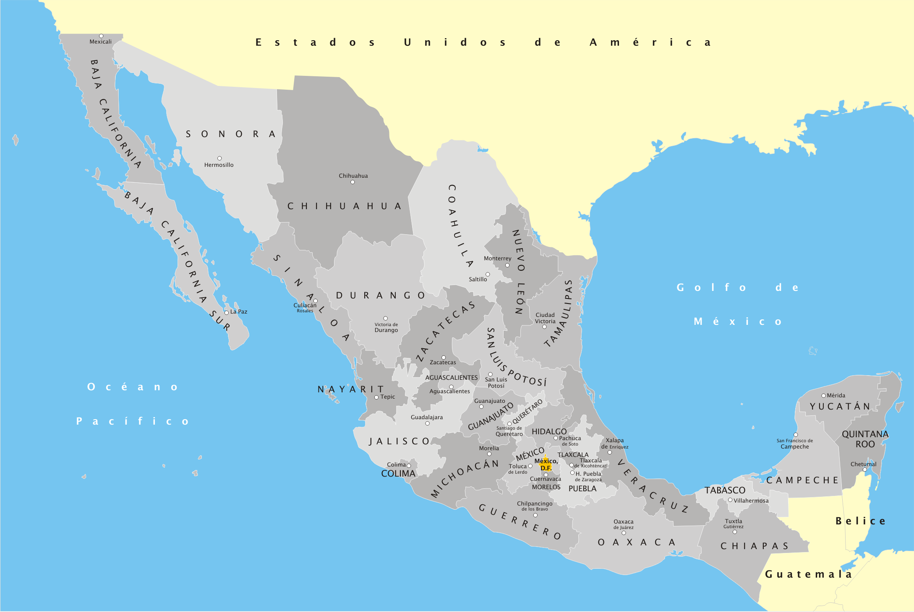
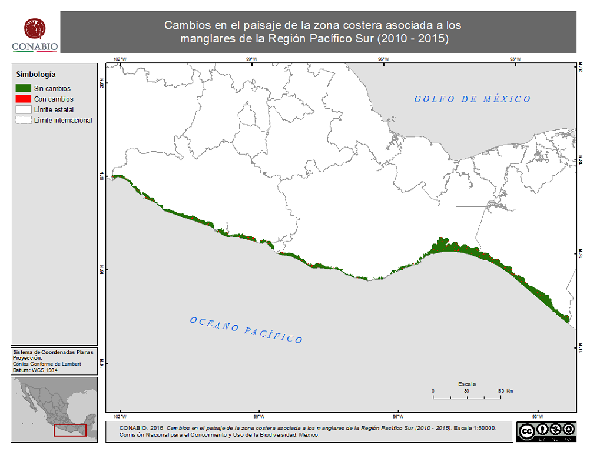
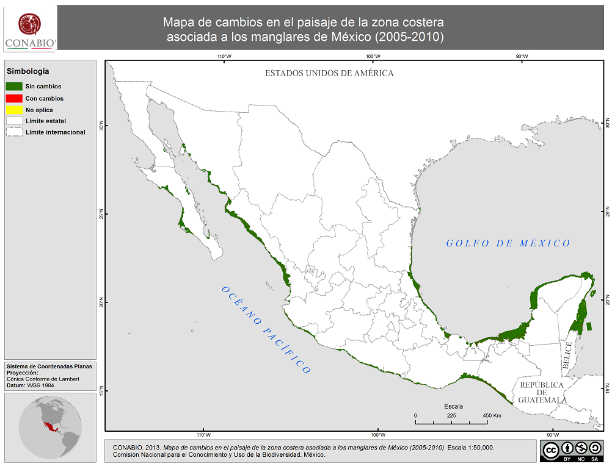

#Executive Summary 

#Introduction
Protocol for Data Input

##General Guide
- No accents
- Entries can be in both Spanish and English (except stated otherwise) 

## Abaout the Metadata fields
All fields x possible things:

1. They can be *mandatory* or *optional*
2. They can be *fixed* values or open *section*

- Fixed: the inputs are part of a select group and no other value is allowed.
- Open: Inpus can be whatever the author decides

3. There could be *multiple values* or a *single one*


```{r Template, echo =F, eval=F}

Data <- read.csv("./Template.csv")

```

#Metadata Fields

##MMID
- Mandatory / Fixed / Single

This is the ID of each data entry. It is important to input this number correcly after the last data point to keep consistency.

##Short Title
- Mandatory / Open / Single

Short informative title of the dataset. There are no limitations on the number of words but it should be as informative as possible.

###Example
*MMID_361:* "Catch of Thunnus alalunga in Mexico (Atlantic)"
*Original dataset title:* SAU eeZ 944 v1-43

##Keywords
- Mandatory / Open / Multiple / Spanish

Words in spanish that best describe the subject or/and dataset. These words will be useful to search data. There is no words limitation. Can be both words and numbers.

**Special Situation:** When a row contains more than one datasets the keywords must have all the datasets available in te repository. 

###Example
For a "normal" row, the keywords could look something like this:
*MMID_361:* Captura; Reconstruida; Atlantico; Industrial; Subsistencia; Artesanal; Deportiva; Thunnus alalunga

**Special Situation:**  A good example fot this section is *MMID_105* where the Short Title of the dataset is "Historic Catch of Calamar for Multiple States". In this case, the original dataset has catch for five different states in Mexico. Hence the keywords, "Calamar; Captura; Campeche; Colima; Oaxaca; Yucatan; Quintana Roo"

##Author
- Mandatory / Open / Multiple
Principal (first) author of the dataset. The author can be a person, group or organization. However, priority must me given to individuals over groups or institutions. In case of multiple authors, an aditional *"et al."* should be included after the first author. Do not include all authors. In case there is no information about the author of the dataset, whoever is uploading the data should be referenced as author.

###Examples
- *MMID_361:* Andres Cisneros-Montemayor
- *MMID_613:* CONABIO
- *MMID_712:* Acosta-Gonzalez, G.; et.al

##Institution
- Optional / Open / Single

Institution where the dataset lives. In the case of multiple institution provide the one that serves as an umbrella. 

###Example
- *MMID_361:* Sea Around Us, SAU
- *MMID_19:* CONAPESCA (even thou CONAPESCA is part of SAGARPA and the Mexican Goverment, the data lives on CONAPESCA's web page)

##Dataset Available
- Mandatory / Fixed / Single

Is the dataset available for consultation or download. This section is numeric and the options are:
1.	Yes, it is public domain and available for consultation and/or download
2.	Yes, it is public domain. However, is not directly available or has some type of limitation (nationality, request, broken link, or is just absent)
3.	No, it is a private dataset

###Examples
- *MMID_361:* 1, The dataset is available for download online
- *MMID_1198:* 2, In this case the dataset is public domain (Mexican goverment). However, it is limited to Mexicans and its access is only uppon request.
- *MMID_1523:* 3, The metadata is available however, the data is not available. A contact information is provided for further inqueries.

##Subject Name
- Mandatory / Open / Single (two words) / Spanish

This category comprehends the name of the principal subject of the dataset. In case of species, priority should be given to scientific names (without author and year). In case the scientific name is unknown the common name should be included in spanish. All entries should be in Spanish, with the clear exception of scientific names.

###Example
- *MMID_361:* Thunnus alalunga
- *MMID_19:* Abulon 
- *MMID_1198:* Chiapas

##Area
- Mandatory / Fixed / Single

The broader category of where the data was generated. Fixed options are as follows:
-	National (When data applies for the whole country or scatter data from both oceans)
- Atlantic Ocean (Covers the Gulf of Mexico and Caribbean)
- Pacific Ocean (Any part within Mexico's Pacific Ocean)
- Freshwater/Terrestrial (When data is related to freshwater and/or land ecosystems)

##Region
- Mandatory / Fixed / Single

A less broad location of the data. While this option is mandatory, the option of "NA" (Not Applicable) is valid. However, authors are encourage to select one of the following options:

-	Gulf of California
-	Northwest Pacific
-	South Pacific
-	Gulf of Tehuantepec
-	Yucatan Peninsula / Mar Caribe
-	West Gulf of Mexico.



**Special Situation**: When data is spread and located in more than one region, authors should act as follow:
a. If data is spread within two contiguous locations, author should choose the one that has the more amount of data
b. If data is spread within two areas that are not connected, then the category should be "NA"

### Example (Special Situation)

- **MMID_630:** In this case the author decided to categorize this data as "Gulf of Tehuantepec" since it covers that whole area and only partiall "South Pacific"


- **MMID_636:** For this dataset Region was determined as "NA" since the data is spread out the country's coastal line.



##Location
- Optional / Open / Single
The more specific level of data localization. It can range from a specific state to georeferenced data. It is an open category with no limitations.

###Example
- *MMID_1198:* Chiapas
- *MMID_15:* Georeference
- *MMID_606:* Laguna de Terminos

##Start and End Year
- Mandatory / Open / Single
The Starting year and end year of the time series.

** Special Situation:** When the row represents multiple dataset with different timeframes, the section should be "NA" (MMID_612)

##Temporal Resolution
- Mandatory / Fixed / Single
What is the temporal resolution of the data? The options are as follows:
-	Annual
-	Monthly
-	Semester
-	Weekly
-	Daily
-	Seconds

** Special Situation:** Likewise Location

##Data Time Points
This section refers to the amount of data points available in the dataset. It is related to the start and end year.

**Special Situation** 

# AQUI ME QUEDE 

###Example
**MMID_361:** 55. The dataset starts in 1952 and ends in 2010, hence, there are 52 datapoints.
**MMID_377:** 5. The dataset starts in 1954 and ends in 1966, however, there are only 5 years with data and not 13. 

**Special Situation**


##Unit Type
### Definition
They type of unit used. Fixed Values
- Area
- Size
- Weight
- Values
- Counts
- Index
- Temperature
- Concentration
- pH
- Depth

##Spatial Resolution
### Definition
What is the spatial resolution of the data
### Example
It could be a "state", it could be coordinates.

##Dataset Title
### Definition
Original name of dataset (the data specifically, not the source or repository where it was published).
### Example
- Producción Annual de Octopus Nei.
- PARTICIPACIÓN DE LA ACUACULTURA EN EL VALOR DE LA PRODUCCIÓN PESQUERA NACIONAL
- Personal Ocupado en el Sector Pesca

This are all datasets that are found inside the Anuario Estadístico de Acuacultura y Pesca 2013

##Compilation Title
### Definition
Name of the document or repository where data is presented
### Example
- FAO fisheries quantity
- Anuario Estadístico SAGARPA
- Censo Poblacional de INEGI

This are all mayor aggregations/spurces of data
##Publication Year
### Definition
Year in which the dataset was published
### Example
1998
##Reference
Link or address of where the data can be found

### Example
www.repositoryonlinewheredatalives.com or Meta-dataset 

##Available in Metadata
If the data is or not part of the Meta-dataset data repository

##Metadata Name
In case the data set is in the Meta-data, then what's the name of it?

##User Contact
Name and email of person who identified and/or added the data to the Metadata

##Institution Type
The type of institution that generated the dataset (corresponds to "Institution" field)

##Research Fund
Who funded the data collection

##Research Field
What was the main reason why the data was  gathered 

##Social-Economic Interaction
What type of social-ecological interaction is this data an indicator for

##Data-Uncertanty
What is the quality of the data?


