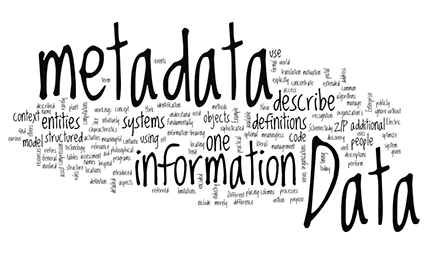
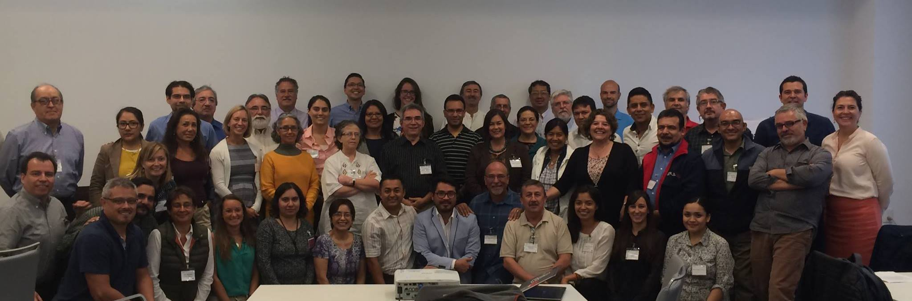
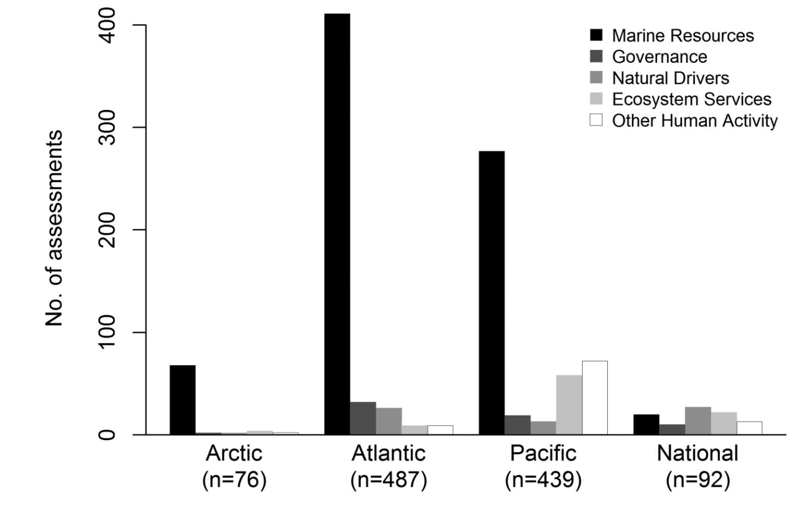
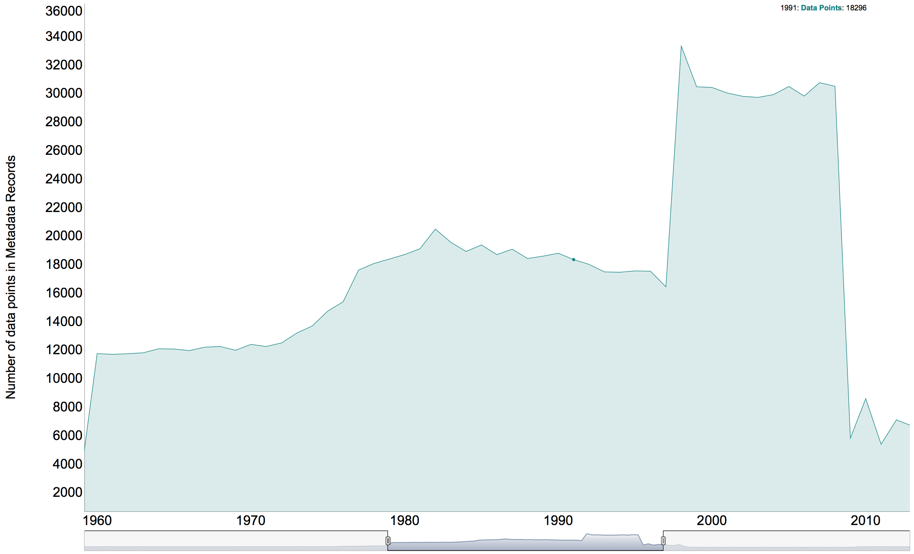
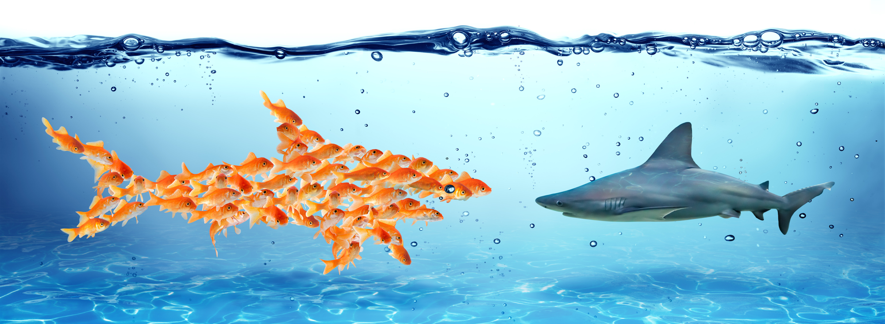

```{r packages and data, eval=T, echo=F, warning=F,message=F}

library(data.table)
library(networkD3)
library(dygraphs)
library(dplyr)
library(DT)
library(ggplot2)
library(wordcloud) #For Word Mining
#install.packages('tm')
library(tm) #For Word Mining
library(knitr)
library(leaflet)
library(gridExtra)
library(tidyr)

data<- fread("/Users/jpalacios/Documents/Github/Meta_Data_Mexico/App/Template_4.1.csv",
                 colClasses = c(Location = 'character',
                                Notes = 'character',
                                Data_Uncertanty ='character',
                                Data_Time_Points = 'numeric')
)

K_data<- read.csv("/Users/jpalacios/Documents/Github/Meta_Data_Mexico/App_Eng/Metadata_Key.csv",
                  header = TRUE,
                  na="NA")

x <- fread("/Users/jpalacios/Documents/Github/Meta_Data_Mexico/App_Eng/Data_Curve.csv")
x <- x %>%
  select(-1,
         -Real_Total,
         -Temp)
```

## The late evening show {.emphasized}

- Introduction
    + Motivation
    + Project Objectives
- Metadatabase Structure
- Current Status of the Metadata
- Preeliminary Results
- How to collaborate

<div class="centered">
<div class="red">

>* In progress | NO Data | Invitation for collaboration

</div>

## Data Vs Metadata

- **Data:** facts and statistics collected together for reference or analysis (Oxford Diccionary, 2017).

- **Metadata:** *“Information about data”* -i.e., the information required to understand data, including data set contents, context, quality, structure, and accessibility (Michener et al., 1997)
    
    -  In short, the *“who, what, when, where, and how”* about every aspect of the data.

<div class="centered">




</div>

## Project Motivation

<div class="centered">

> 

> 

***

<div class="centered">




***

<div class="columns-2">


- Increasingly depending on multidisciplinary research

- Biology, Ecology, Oceanography, Economy, etc!

- Lack of data or lack of data availability?

<div class="red">

- No matter which, the result can block progress

</div>
</div>

<div class="centered">
<div class="green2">

> - A meta-database fosters collaboration and eases the process of informing best policies relevant to any community or region

</div>

## Project Objectives

> -	Design a framework for the meta-database of marine ecosystems and marine-related research of Mexico

<div class="green2">
> -	**Identify available data sources and incorporate into developed meta-database framework**
> -	Identify the major trends in marine data availability in Mexico 
> -	Identify information and research gaps that should be addressed in the future

</div>
> -	Develop protocols for public sharing of the meta-database and inclusion of new information in the future

## Metadata Structure {.biger}

```{r Metadata Structure, eval=T, echo=F, warning=F,message=F}

 Title <- names(data)
kable(
  data.table(
  "Structure" = Title[1:7],
  "Structure" = Title[8:14],
   "Structure" = Title[15:21],
  "Structure" = Title[22:28]
),
col.names = NA
)

```


## Current Status of the Metadata

<div class="centered">

```{r Current Status, eval=T, echo=F, warning=F,message=F, fig.align="center"}

xx <- ts(x,
         start=c(2016,11),
         end = c(2017,7), # <- this has to be changed everytime we add a month
         frequency= 12)

dygraph(xx) %>% #Creats the graph
  dyOptions(stackedGraph = TRUE, #Makes it stacked
            drawPoints = TRUE, #Shows each data point
            pointSize = 4) %>%
  dyRangeSelector(height = 20) %>%
  dyAxis("x", drawGrid = FALSE) %>% #Removes the grid
  dyAxis("y", drawGrid = FALSE) %>%
  dyAxis("y", label = "Number of Data Points") %>%  #Labels
  dyLegend(width = 600)

## Solid numbers ####

# Number of entries ####
Number_entries <- data %>%
  filter(MMID != "na")

Number_entriess <- paste(Number_entries$MMID[length(Number_entries$MMID)])

# Number of Data Points ####
Number_dp <- paste(round(sum(Number_entries$Data_Time_Points,na.rm=T)/1000),0)

# Number of Repositories ####
z<- data %>%
  group_by(Compilation_Title) %>%
  summarise(sum(Data_Time_Points)) %>%
  select(-2) %>%
  filter(!is.na(Compilation_Title)) %>%
  mutate(z = 1)

zz <- paste(sum(z$z))

```

***

Geolocalization of records

<div class="centered">

```{r Map, eval=T,echo=F, warning=F,message=F, fig.width=9, fig.height=4.5, fig.align="center"}

Temp <- data %>% 
  filter(!is.na(Lat))

leaflet(Temp) %>%
      addTiles(
        urlTemplate = 'http://{s}.tile.osm.org/{z}/{x}/{y}.png'
        # attribution = 'Maps by <a href="http://www.mapbox.com/">Mapbox</a>'
      ) %>%
      #Initial view #
      setView(lng = -102.5528, 
              lat = 23.6345,
              zoom = 5) %>% 
    addMarkers(
      lng = ~Long,
      lat = ~Lat,
      popup = ~Short_Title,
      clusterOptions = markerClusterOptions()
    )

```

> Since November we have colected: **`r Number_entriess`** Records, from **`r zz`** repositories, representing more than **`r Number_dp`** data points

## Preliminary Results

```{r Preeliminarya, eval=T, echo=F, warning=F,message=F, fig.width=9,fig.height=4.5, fig.align="center"}

Spp <- data %>%
  group_by(Area) %>%
        summarise(Entradas = n()) %>%
        filter(Area !="NA") %>% 
  filter(Area != "") %>% 
  ggplot(.,
             aes(
               x=reorder(Area, -Entradas),
               y=Entradas,
               fill=Area
             )) +
        geom_bar(stat="identity")+
        #coord_flip()+
        theme_classic() +
        ylab("Metadata Records")+
        xlab("Area")+
        theme(axis.text.x = element_text(hjust = 1,
                                         size=14,
                                         angle=45),
              axis.text.y = element_text(size = 14),
              legend.position = "none",
              axis.title = element_text(size=20,
                                        face="bold")
        )
Spp2 <- data %>% 
  group_by(Region) %>%
          summarise(Value = n()) %>% 
          filter(Region != "na") %>% 
          filter(Region != "") %>% 
  filter(Region != "TBD") %>% 
  ggplot(.,
               aes(
                 x=reorder(Region, -Value),
                 y=Value,
                 fill=Region
               )) +
          geom_bar(stat="identity")+
          theme_classic() +
          xlab("Region")+
  ylab("Metadata Records") +
          theme(axis.text.x = element_text(hjust = 1,
                                           size=14,
                                           angle = 45),
                axis.text.y = element_text(size = 14),
                legend.position = "none",
                axis.title = element_text(size=20,
                                          face="bold")
          )

grid.arrange(Spp,
             Spp2,
             ncol=2)
        
        
```


</div>

***

Research topics by litoral

```{r Research_field_Record, eval=T,echo=F,fig.width=9,fig.height=5, fig.align="c"}

Tot <- data %>% 
  filter(!is.na(Area)) %>% 
  filter(!is.na(Research_Field)) %>%
  filter(Research_Field !="Other") %>% 
  filter(Area != "TBD") %>% 
  group_by(Area) %>% 
  summarise(Entradas_tot = n())

Se_Plot <- data %>% 
  filter(!is.na(Area)) %>% 
  filter(!is.na(Research_Field)) %>%
  filter(Research_Field !="Other") %>% 
  filter(Area != "TBD") %>% 
  group_by(Area,Research_Field) %>% 
  summarise(Entradas = n()) %>% 
  left_join(Tot,
            by="Area") %>% 
  mutate(Per = (Entradas/Entradas_tot)*100)


ggplot(data=Se_Plot,
       aes(
         x=Area,
         y=Per,
         fill= Research_Field
       ))+
  geom_bar(stat = "identity")+
  theme_classic() +
  ylab("Porsentaje del total de\n registros por área")+
  xlab("Area")+
  theme(axis.text.x = element_text(
                                   size=14
                                   ),
        axis.text.y = element_text(size = 14),
        legend.position = "top",legend.text=element_text(size=16),
        axis.title = element_text(size=20,
                                  face="bold"))+ 
  guides(fill = guide_legend(title = "Research Field",
                             title.position = "left"))
```

***

Frequent words on Aquaculture and Fisheries records


```{r WordCloud, eval=T, echo=F, warning=F,message=F, fig.align="center"}

Words_F <- data %>% 
  filter(Research_Field == "Fisheries" |
           Research_Field == "Aquaculture")

WordsCorpus_Fish <- Corpus(VectorSource(Words_F$Keywords)) #Selects only Keywords
Word_Remove_Fish <- c("Acuacultura",
                      "Pesca")

WordsCorpus <- tm_map(WordsCorpus_Fish,
                      removeWords,
                      Word_Remove_Fish)

wordcloud(WordsCorpus, #Plots the words
              max.words = 250,
              random.order = FALSE,
              colors=brewer.pal(8, "Dark2")
)

```

***

Analysis of what type of institutions are donnors, what are doing the actual research, and in what fields

```{r Network Flow, eval=T, echo=F, warning=F, message=F, fig.align="center", fig.width= 10}

Category <- data.table::data.table(Name=c(
    "AAcademic",
    "Aquaculture",
    "Goverment",
    "Inter. Gov (IGO)",
    "International",
    "NGO",
    "Unknown",
    "Conservation",
    "Ecology",
    "Fisheries",
    "Oceanography",
    "Sociology",
    "Turism",
    "Other",
    "NGO Funding",
    "Private Funding",
    "Goverment Fu",
    "ACA_F",
    "Inter. Gov (IGO) Funding",
    "International Funding"
  )
  ) %>% 
    arrange(Name)

R_Fund_Org <-data %>%
    group_by(Research_Fund,
             Institution_Type) %>%
    summarise(Value =n()) %>%
    rename(Source = Research_Fund,
           Target = Institution_Type)
  
  Inst_Field <-data %>%
    filter(!is.na(Institution_Type)) %>%
    group_by(Institution_Type,Research_Field) %>%
    summarise(Value = n()) %>%
    rename(Source = Institution_Type,
           Target = Research_Field)
  
  Final_Table <- R_Fund_Org %>%
    bind_rows(Inst_Field) 
  
  Final_Table <- data.frame(ID = seq(1:nrow(Final_Table))) %>% 
    bind_cols(Final_Table)
  
  Final_Table_N <- Final_Table %>% 
    gather("Category","Character",2:3) %>% 
    arrange(Character)
  
  Final_Table_N$Character <- as.integer(as.factor(Final_Table_N$Character))
  Final_Table_N$Character <- as.numeric(as.integer(Final_Table_N$Character)-1)
  
  Source <- Final_Table_N %>% 
    filter(Category == "Source") %>% 
    select(-Category) %>% 
    rename(Source = Character)
  
  Target <- Final_Table_N %>% 
    filter(Category == "Target") %>% 
    select(-Category,-Value) %>% 
    rename(Target = Character) %>% 
    left_join(Source,
              by ="ID")
  
  
  sankeyNetwork(Links = Target, #Dataset with Source, Target and value
                Nodes = Category, #Dataset withe the Names
                Source = "Source", #Source column in Links dataset
                Target = "Target", #Target column in Links dataset
                Value = "Value", # The amount to plot from the Links dataset
                NodeID = "Name", #What's showing when mouse over Node
                units = "Records", #Units to show
                fontSize = 12,
                nodeWidth = 30)


```

***

Historical of collected data in Mexico

<div class="centered">



</div>

## Direct Collaboration
<div class="centered">



</div>

***

- We invite *you* to think on research questions and applications for this dataset as it is (will) available for everyone!
- We encourage you to share the information you have about your data, this will:
    + Create new opportunities for collaboration 
    + Increase your professional network
    + Support the sustainability of aquatic resources in Mexico
    
<div class="centered">
<div class="green2">

**The more people involved, the better we can reflect the state of marine research in Mexico!**

</div>
</div>


## Thank you !

<div class="centered">

Juliano Palacios-Abrantes | j.palacios@oceans.ubc.ca | @julianop_a

- **Collaborators:**
Arreguín-Sánchez, Francisco; Cheung W., William; Cisneros-Mata, Miguel A; Cisneros-Montemayor, Andres; Rodriguez, Laura


Project's Webpage: http://jepa.shinyapps.io/marmetadatamexeng/

</div>

# Questions?