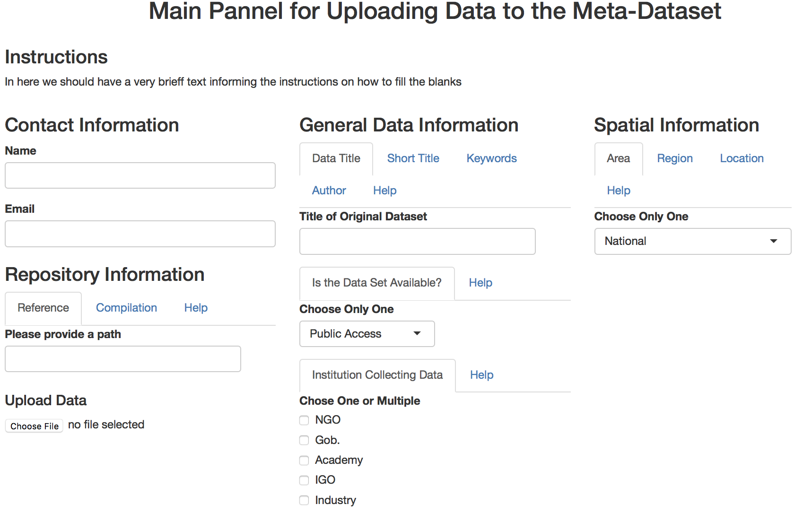
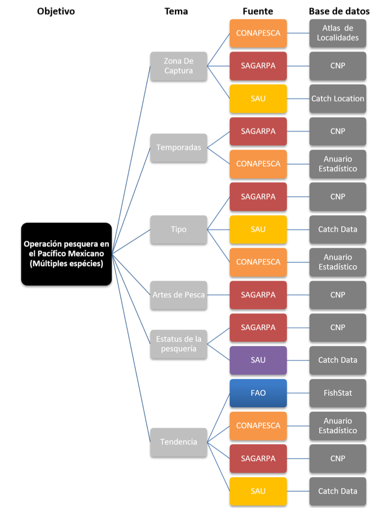
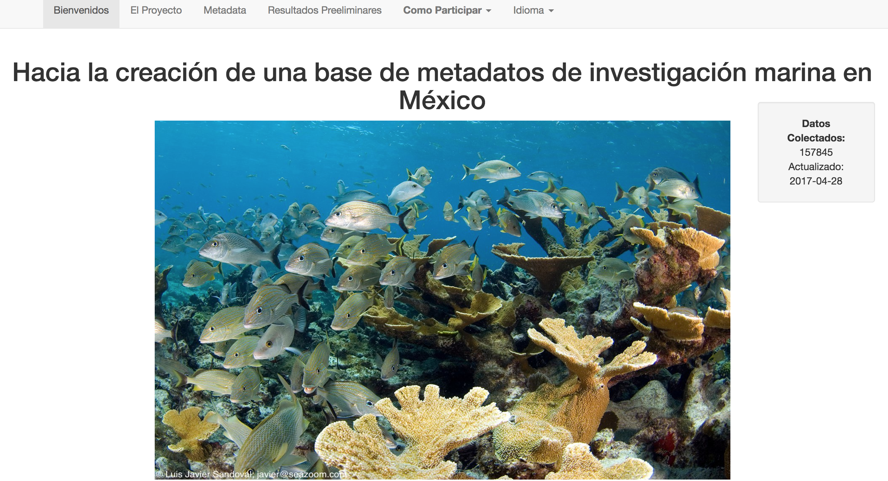

```{r packages and data, eval=T, echo=F, warning=F, message=F}

library(data.table)
library(dygraphs)
library(knitr)
library(dplyr)
library(ggplot2)
library(wordcloud) #For Word Mining
#install.packages('tm')
library(tm) #For Word Mining
library(pander)
library(leaflet)
library(shiny)

data<- fread("/Users/jpalacios/Documents/Github/Meta_Data_Mexico/App/Template_4.1.csv",
                 colClasses = c(Location = 'character',
                                Notes = 'character',
                                Data_Uncertanty ='character',
                                Data_Time_Points = 'numeric')
)
K_data<- read.csv("./Data/GLosario.csv",
                  header = TRUE,
                  na="NA")

x <- fread("/Users/jpalacios/Documents/Github/Meta_Data_Mexico/App/Data_Curve_I.csv")
x <- x %>%
  select(-1,
         -Real_Total)
  
source('ts_fun.R')
  
  
```

## Agenda {.emphasized}

>* Recapitulación del proyecto
>* Estado actual de la base
>* Resultados preliminares
>* Asuntos Pendientes del proyecto
>* Estudio de caso (Pesquerías del Golfo de California)

<div class="centered">
<div class="red">

>* En Andamiento | NO Datos | NO Bibliografía

</div>

## Data Vs Metadatos

- **Datos:** "*Información sobre algo concreto que permite su conocimiento exacto o sirve para deducir las consecuencias derivadas de un hecho"* (RAE)

- **Metadatos:** es la información sobre cada aspecto de los datos que se requiere para entenderlo.
    + Es decir: el ¿qué?, ¿Quién?, ¿cómo?, ¿cuándo?, etc. de los datos...

<div class="centered">


</div>


## Objetivos del Proyecto

> - Diseñar la estructura de la base de metadatos de investigación relacionada con ecosistemas marinos y temas relacionados en México

<div class="green2">
> - **Identificar fuentes de datos disponibles e incorporar los metadatos de los mismos a la estructura**
</div>

> - Identificar tendencias en la disponibilidad de datos en México
> - Identificar vacíos de información que deberían ser tratados a futuro
> - **Desarrollar protocolos para la publicación de la base de metadatos así como la incorporación de nuevos  registros**

<!-- ## Estructura de los Metadatos {.biger} -->

```{r Metadata display, eval=F, echo=F, warning=F,message=F}

 Title <- names(data)
kable(
  data.table(
  "Estructura" = Title[1:7],
  "Estructura" = Title[8:14],
  Estructura = Title[15:21],
  "Estructura" = Title[22:28]
),
col.names = NA
)

```

## Estado actual de la base

<div class="centered">


```{r Current Status, eval=T, echo=F, warning=F,message=F, fig.align="center", fig.width=9}

xx <- ts(x,
         start=c(2016,11),
         end = c(2017,8), # <- this has to be changed everytime we add a month
         frequency= 12)

dygraph(xx) %>% #Creats the graph
  dyOptions(stackedGraph = TRUE, #Makes it stacked
            drawPoints = TRUE, #Shows each data point
            pointSize = 4) %>%
  dyRangeSelector(height = 20) %>%
  dyAxis("x", drawGrid = FALSE) %>% #Removes the grid
  dyAxis("y", drawGrid = FALSE) %>%
  dyAxis("y", label = "Registros en Metadatos") %>%  #Labels
  dyLegend(width = 600)

## Solid numbers ####

# Number of entries ####
Number_entries <- data %>%
  filter(MMID != "na")

Number_entriess <- paste(Number_entries$MMID[length(Number_entries$MMID)])

# Number of Data Points ####
Number_dp <- paste(round(sum(Number_entries$Data_Time_Points,na.rm=T)/1000))

# Number of Repositories ####
z<- data %>%
  group_by(Compilation_Title) %>%
  summarise(sum(Data_Time_Points)) %>%
  select(-2) %>%
  filter(!is.na(Compilation_Title)) %>%
  mutate(z = 1)

zz <- paste(sum(z$z))

```

<div class="green2">

>- Desde noviembre se han colectado: **`r Number_entriess`** registros, de **`r zz`** repositorios que equivalen a más de **`r Number_dp`** mil datos de investigación marina en México

</div>
</div>

## Resultados preliminares (Generales) {.smaller}

```{r Preeliminarya, eval=T, echo=F, warning=F,message=F, fig.width=9,fig.height=4.5, fig.align="center"}

Spp <- data %>% 
  filter(Area != "TBD") %>% 
  group_by(Area) %>% 
  summarise(Entradas = n()) %>% 
  filter(Area !="na") %>% 
  filter(Area !="")

P1 <- ggplot(data= Spp,
       aes(
         x=reorder(Area, -Entradas),
         y=Entradas,
         fill=Area
       )) +
  geom_bar(stat="identity")+
  #coord_flip()+
  theme_classic() +
  ylab("Número de Registros")+
  xlab("Área")+
  theme(axis.text.x = element_text(hjust = 1,
                                   size=14,
                                   angle=45),
        axis.text.y = element_text(size = 14),
        legend.position = "none",
        axis.title = element_text(size=14,
                                  face="bold")
        
  )
Spp2 <- data %>%
  filter(Region != "TBD") %>% 
  group_by(Region) %>%
  summarise(Value = n()) %>% 
  filter(Region != "na") %>% 
  filter(Region != "")

P2 <-ggplot(data= Spp2,
       aes(
         x=reorder(Region, -Value),
         y=Value,
         fill=Region
       )) +
  geom_bar(stat="identity")+
  theme_classic() +
  ylab("Número de Registros")+
  xlab("Región")+
  theme(axis.text.x = element_text(hjust = 1,
                                   size=14,
                                   angle = 45),
        axis.text.y = element_text(size = 14),
        legend.position = "none",
        axis.title = element_text(size=14,
                                  face="bold")
  )

gridExtra::grid.arrange(
  P1,
  P2,
  ncol = 2
)

```

## Asuntos Pendientes del Proyecto

1. Formalizar relación de colaboración
    + Colaboración entre CONABIO y el grupo de trabajo del proyecto de metadatos.
    + Colaboración con instituciones para fomentar el uso y contribución a la base de metadatos. 

2. Programador
    + Método amigable de visualización de la base de metadatos
    + Mapa para usuario 
    + Capacidad de subir datos
    + Gráficas y resultados 
    + Generar códigos para automatizar la actualización de bases de datos 

***

[Método Amigable de ver los datos](http://monitoreonoroeste.mx/buscar.php#mapa)

***

```{r Map, eval=T,echo=F, warning=F,message=F, fig.width=9, fig.height=5, fig.align="center"}

Temp <- data %>% 
  filter(!is.na(Lat))

leaflet(Temp) %>%
      addTiles() %>%
      #Initial view #
      setView(lng = -102.5528, 
              lat = 23.6345,
              zoom = 5) %>% 
    addMarkers(
      lng = ~Long,
      lat = ~Lat,
      popup = ~Short_Title,
      clusterOptions = markerClusterOptions()
    )

```

[Ejemplo de Mapa para Usuario](http://www.icmyl.unam.mx/uninmar/mapa.jsf;jsessionid=813d12593177cf7633d55fc7f94c#zoom=5&lat=23.56735&lon=-103.45459&layers=B00T)

***

 Ejemplo de interfáz para subir datos
 
 
 
***

[Ejemplo de Graficas y Resultados](http://datamares.ucsd.edu/stories/monitoring-manta-rays-in-bahia-de-banderas-mexico/#viz)

## Estudio de caso

<div class="centered">

**Descripción de la operación pesquera en el Pacífico Mexicano a partir de una base de metadatos**

</div>

- **Objetivo:** Encontrar información para describir aspectos específicos de la operación pesquera de una selección de especies en el Pacífico Mexicano. 

- Información requerida: 
    + Zona de Captura
    + Temporadas
    + Tipo de pesquería
    + Artes de pesca
    + Estatus de la pesquería
    + Tendencia de la pesquería
    
  
## Estudio de caso [Resultado]

<div class="columns-2">



<br>


</div>

## ¡Gracias!

<div class="centered">

- Juliano Palacios-Abrantes | j.palacios@oceans.ubc.ca

- **Colaboradores:**
Arreguín-Sánchez F, Cheung W. William, Cisneros-Mata Miguel A., Cisneros-Montemayor Andrés, Rodriguez Laura


Página del proyecto: https://jepa.shinyapps.io/marmetadatamexesp/

</div>

***
<div class="centered">



# ¿Preguntas?
