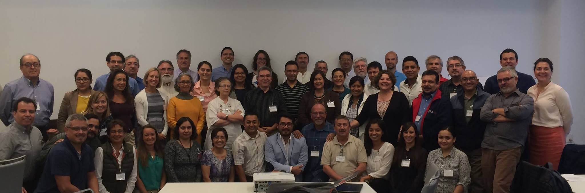

```{r packages and data, eval=T, echo=F, warning=F, message=F}

library(data.table)
library(dygraphs)
library(knitr)
library(dplyr)
library(ggplot2)
library(wordcloud) #For Word Mining
#install.packages('tm')
library(tm) #For Word Mining
library(pander)
library(DT)

data<- fread("/Users/jpalacios/Documents/Github/Meta_Data_Mexico/App_Esp/Templateb.csv",
             colClasses = c(Location = 'character',
                            Notes = 'character')
)
K_data<- read.csv("./Data/GLosario.csv",
                  header = TRUE,
                  na="NA")

x <- fread("/Users/jpalacios/Documents/Github/Meta_Data_Mexico/App_Esp/Data_Curve.csv")
x <- x %>%
  select(-1)
  
source('ts_fun.R')
  
  
```

## Agenda {.emphasized}

>* Introducción
>* * Motivación
>* * Objetivos del proyecto
>* Estructura de la base de metadatos
>* Estado actual de la base
>* Resultados preliminares
>* Como colaborar

<div class="centered">
<div class="red">

>* En Andamiento | NO Datos | Invitación a Colaborar

</div>

## Motivación del proyecto

<div class="centered">

>  

> 

***

<div class="centered">


***

<div class="columns-2">


>- Aumento en la investigación multidisciplinaria

>- Biología, Ecología, Oceanografía, Economía, etc.

<div class="black">

>- ¿Falta de datos? o ¿falta de disponibilidad de datos?

</div>
<div class="red">

>- **Sin importar cuál sea, el resultado puede bloquear el progreso**

</div>
</div>

<div class="centered">
<div class="green2">

>- Una Base de metadatos fomenta la colaboración y apoya la toma de decisiones relevante a cualquier comunidad o región del país

</div>
</div>

## Data Vs Metadata

- **Datos:** "*Información sobre algo concreto que permite su conocimiento exacto o sirve para deducir las consecuencias derivadas de un hecho"* (RAE)

- **Metadatos:** es la información sobre cada aspecto de los datos que se requiere para entenderlo. 
    - - Es decir: el ¿qué?, ¿Quién?, ¿cómo?, ¿cuándo?, etc. de los datos...

<div class="centered">


</div>

## Objetivos del Proyecto

> - Diseñar la estructura de la base de metadatos de investigación relacionada con ecosistemas marinos y temas relacionados en México

<div class="green2">
> - **Identificar fuentes de datos disponibles e incorporar los metadatos de los mismos a la estructura**
</div>

> - Identificar tendencias en la disponibilidad de datos en México
> - Identificar vacíos de información que deberían ser tratados a futuro
> - Desarrollar protocolos para la publicación de la base de metadatos así como la incorporación de nuevos  registros

## Estructura de los Metadatos {.biger}

```{r Metadata display, eval=T, echo=F, warning=F,message=F}
library(shiny)


ui <- fluidPage(
  tabsetPanel(
    id ="Data_Explorer",
    tabPanel(
      p("Glosario Metadatos"),
      dataTableOutput("Metadata_Key")
    ),
    tabPanel(
      p("Metadatos"),
      dataTableOutput("datatable")
    )
  )
)


server <- function(input, output) {
  output$Metadata_Key <- renderDataTable({


    datatable(K_data,
              rownames = FALSE,
              filter = 'top',
              escape = FALSE,
              options = list(pageLength = 50,
                             autoWidth = FALSE,
                             language = list(url = '//cdn.datatables.net/plug-ins/1.10.11/i18n/Spanish.json')
              )
    )

  })

  output$datatable <- renderDataTable({

    datatable(data,
              rownames = FALSE,
              filter = 'top',
              escape = FALSE,
              options = list(pageLength = 28,
                             autoWidth = FALSE,
                             lengthMenu = c(10, 20,30),
                             language = list(url = '//cdn.datatables.net/plug-ins/1.10.11/i18n/Spanish.json')
              )
    )
  })
}

# Run the application
shinyApp(ui = ui, server = server)

```

## Estado actual de la base

<div class="centered">

```{r Current Status, eval=T, echo=F, warning=F,message=F, fig.align="center"}

xx <- ts(x,
         start=c(2016,11),
         end = c(2017,4), # <- this has to be changed everytime we add a month
         frequency= 12)

dygraph(xx) %>% #Creats the graph
  dyOptions(stackedGraph = TRUE, #Makes it stacked
            drawPoints = TRUE, #Shows each data point
            pointSize = 4) %>%
  dyRangeSelector(height = 20) %>%
  dyAxis("x", drawGrid = FALSE) %>% #Removes the grid
  dyAxis("y", drawGrid = FALSE) %>%
  dyAxis("y", label = "Número de Registros") %>%  #Labels
  dyLegend(width = 600)

## Solid numbers ####
# Number of entries ####
Number_entries <- data %>%
  filter(MMID != "na")
Number_entriess <- paste(Number_entries$MMID[length(Number_entries$MMID)])

# Number of Data Points ####
Number_dp <- paste(sum(Number_entries$Data_Time_Points,na.rm=T))

# Number of Repositories ####
z<- data %>%
  group_by(Compilation_Title) %>%
  summarise(sum(Data_Time_Points)) %>%
  select(-2) %>%
  filter(!is.na(Compilation_Title)) %>%
  mutate(z = 1)

zz <- paste(sum(z$z))

```

>- Desde noviembre se han colectado: **`r Number_entriess`** registros, de **`r zz`** repositorios que equivalen a **`r Number_dp`** datos de investigación marina en México

</div>

## Fuentes de Información

```{r Info_Academia, eval=T, echo=F}

Aca <- data %>% 
  filter(Institution_Type=="Academic") %>% 
  group_by(Institution) %>% 
  summarise(n=n()) %>% 
  select(Institution)

kable(
  data.table(
  "Academicas" = Aca$Institution[1:6],
  "Academicas" = Aca$Institution[7:12]
),
col.names = NA,
align = "c"
)


```

***

```{r Info_Gobierno, eval=T, echo=F}

Gov <- data %>% 
  filter(Institution_Type=="GOV") %>% 
  group_by(Institution) %>% 
  summarise(n=n()) %>% 
  select(Institution)

kable(
  data.table(
  "Gobierno" = Gov$Institution[1:6],
  "Gobierno" = Gov$Institution[7:12]
),
col.names = NA,
align = "c"
)

```


## Resultados preliminares {.smaller}

* Se pueden generar resultados con cierta característica espacial.
* Por tema de investigación
* Por tipo de dato

```{r Preeliminar_a, eval=T, echo=F, warning=F,message=F, fig.width=5.5,fig.height=4.5, fig.align="center"}

ui <- fluidPage(
sidebarLayout(
      sidebarPanel(
        selectInput(
          "Plot_Option",
          label= "Resolución Espacial:",
          choices = list("Area" = 1,
                         "Región" = 2,
                         "Localidad" =3
                        )
        ),
        selectInput(
          "Plot_Type",
          label= "Otras Opciones:",
          choices = list(
            "Select" = 0,
            "Disciplina" = 1,
            "Interacción SE" = 2,
            "Fuente de Info" = 3
                        )
        )
      ),
        mainPanel(
          plotOutput("Number_spp")
      )
   )
)

server <- function(input, output) {
output$Number_spp <- renderPlot({

    if(input$Plot_Type == 0 & input$Plot_Option == 1){
      Spp <- data %>%
        filter(Area != "TBD") %>%
        group_by(Area) %>%
        summarise(Entradas = sum(Data_Time_Points,na.rm=T)) %>%
        filter(Area !="na") # %>%
      # filter(Entradas >= input$Num_Data_Range[1]) %>%
      # filter(Entradas <= input$Num_Data_Range[2])

      ggplot(data= Spp,
             aes(
               x=reorder(Area, -Entradas),
               y=Entradas,
               fill=Area
             )) +
        geom_bar(stat="identity")+
        #coord_flip()+
        theme_classic() +
        ylab("Números de Datos")+
        xlab("Campo de Investigación")+
        theme(axis.text.x = element_text(hjust = 1,
                                         size=14,
                                         angle=45),
              axis.text.y = element_text(size = 14),
              legend.position = "none",
              axis.title = element_text(size=14,
                                        face="bold")

        )

    }else{
      #### By Region ####
      if(input$Plot_Type == 0 & input$Plot_Option == 2){
        Spp2 <- data %>%
          filter(Region != "TBD") %>%
          group_by(Region) %>%
          summarise(Value = sum(Data_Time_Points,na.rm=T)) %>%
          filter(Region != "na") %>%
          filter(Region != "")

        ggplot(data= Spp2,
               aes(
                 x=reorder(Region, -Value),
                 y=Value,
                 fill=Region
               )) +
          geom_bar(stat="identity")+
          theme_classic() +
          ylab("Número de Datos")+
          xlab("Región")+
          theme(axis.text.x = element_text(hjust = 1,
                                           size=14,
                                           angle = 45),
                axis.text.y = element_text(size = 14),
                legend.position = "none",
                axis.title = element_text(size=14,
                                          face="bold")
          )

      }else{
        #### By Location ####
        if(input$Plot_Type == 0 & input$Plot_Option == 3){
          Spp3 <- data %>%
            filter(Location != "na") %>%
            filter(Location != "Multiple States") %>%
            group_by(Location) %>%
            summarise(Value = sum(Data_Time_Points,na.rm=T)) %>%
            arrange(desc(Value))

          Head_Spp3 <- head(Spp3,5) %>%
            arrange(desc(Value))


          ggplot(data= Head_Spp3,
                 aes(
                   x=reorder(Location, -Value),
                   y=Value,
                   fill=Location
                 )) +
            geom_bar(stat="identity")+
            theme_classic() +
            coord_flip() +
            ylab("Número de Datos")+
            xlab("Localidad")+
            theme(axis.text.x = element_text(hjust = 1,
                                             size=14,
                                             angle=45),
                  axis.text.y = element_text(size = 14),
                  legend.position = "none",
                  axis.title = element_text(size=14,
                                            face="bold")
            )
        }else{
          if(input$Plot_Type == 1){
            Se_Plot <- data %>% 
  filter(!is.na(Area)) %>% 
  filter(!is.na(Research_Field)) %>% 
  filter(Research_Field!="Other") %>%             
  filter(Area != "TBD") %>% 
  group_by(Area,Research_Field) %>% 
  summarise(Entradas = n())


ggplot(data=Se_Plot,
       aes(
         x=Area,
         y=Entradas,
         fill= Research_Field
       ))+
  geom_bar(stat = "identity")+
  theme_classic() +
  ylab("Número de\n registros")+
  xlab("Area")+
  theme(axis.text.x = element_text(
                                   size=14
                                   ),
        axis.text.y = element_text(size = 14),
        legend.position = "top",
        legend.text=element_text(size=16),
        axis.title = element_text(size=20,
                                  face="bold"))+ 
  guides(fill = guide_legend(title = "Disciplina",
                             title.position = "left"))
        }else{
          if(input$Plot_Type == 2){
          Se_Plot <- data %>% 
  filter(!is.na(Area)) %>% 
  filter(!is.na(SE_Interaction)) %>% 
  filter(SE_Interaction!="NA") %>% 
  filter(Area != "TBD") %>% 
  group_by(Area,SE_Interaction) %>% 
  summarise(Entradas = n())


ggplot(data=Se_Plot,
       aes(
         x=Area,
         y=Entradas,
         fill= SE_Interaction
       ))+
  geom_bar(stat = "identity")+
  theme_classic() +
  ylab("Número de\n registros")+
  xlab("Area")+
  theme(axis.text.x = element_text(
                                   size=14
                                   ),
        axis.text.y = element_text(size = 14),
        legend.position = "top",
        legend.text=element_text(size=16),
        axis.title = element_text(size=20,
                                  face="bold"))+ 
  guides(fill = guide_legend(title = "Interacción SE",
                             title.position = "left"))
          }else{
          if(input$Plot_Type == 3){
          Se_Plot <- data %>% 
  filter(!is.na(Area)) %>% 
  filter(!is.na(Institution_Type)) %>% 
  filter(Area != "TBD") %>% 
  group_by(Area,Institution_Type) %>% 
  summarise(Entradas = n())


ggplot(data=Se_Plot,
       aes(
         x=Area,
         y=Entradas,
         fill= Institution_Type
       ))+
  geom_bar(stat = "identity")+
  theme_classic() +
  ylab("Número de\n registros")+
  xlab("Area")+
  theme(axis.text.x = element_text(
                                   size=14
                                   ),
        axis.text.y = element_text(size = 14),
        legend.position = "top",
        legend.text=element_text(size=16),
        axis.title = element_text(size=20,
                                  face="bold"))+ 
  guides(fill = guide_legend(title = "Tipo de Institución",
                             title.position = "left"))
            }
            }    
        }
          }
      }
    }
  })
}

# Run the application
shinyApp(ui = ui, server = server)

```

***
Podemos hacer una reconstrucción de los datos generados en México en los últimos años.

```{r Historic_Data, echo=F,eval=T}
Pedroche<- fread("/Users/jpalacios/Documents/Github/Meta_Data_Mexico/App_Esp/Pedroche_Hist.csv")
Pedroche <- Pedroche %>% 
  select(-1)
  
    
    Hist <- data %>%
      filter(MMID <=2861) %>%
      select(Start_Year,End_Year) # <- Temporary fix for Brusca and Pedroche data
    
    #Reads Predoche fixed data from the Parallel Analysis
    
    # #Join both datasets and removes NA's
    Fin_Plot <- Pedroche%>%
      bind_rows(Hist) %>%
      filter(!is.na(Start_Year))
    

    #Plots the Historic contribution
    ts_plot(Fin_Plot,1920,2020)

```

## Palabras clave más frecuentes

También se puede utilizar para hacer exploración más cualitativa o para hacer comunicación.

```{r Preeliminaryb, eval=T, echo=F, warning=F,message=F, fig.align="center"}

Words <- data
WordsCorpus <- Corpus(VectorSource(Words$Keywords)) #Selects only Keywords
WordsCorpus <- tm_map(WordsCorpus,
                      PlainTextDocument) #Converts to plain text
WordsCorpus <- tm_map(WordsCorpus,
                      removePunctuation) #Removes punctuation

#Removes a word of user preference
# WordsCorpus <- tm_map(WordsCorpus,
#                       removeWords)
#

suppressWarnings(wordcloud(WordsCorpus, #Plots the words
                           max.words = 100,
                           random.order = FALSE,
                           colors=brewer.pal(8, "Dark2")
)
)

```


## Esfuerzo Colaborativo

<div class="columns-2">

 

>- **Informa:** Estamos buscando por cualquier fuente de datos relevante a los ecosistemas marinos en México.

>- **Difunde:** Parte del éxito de este proyecto depende de la cantidad de participantes involucrados y las distintas disciplinas que se logren reflejar

<div class="green2">
>- **No** estamos colectando datos si no que **Información** sobre los mismos
</div>

***

<div class="centered">
<div class="green2">

**¡Cuantas más personas participen, mejor podremos reflejar el estado de la investigación marina en México!**

</div>
</div>


## ¡Gracias!

<div class="centered">

Juliano Palacios-Abrantes | j.palacios@oceans.ubc.ca

- **Colaboradores:**
Arreguín-Sánchez F, Cheung W. William, Cisneros-Mata Miguel A, Cisneros-Montemayor Andres, Rodriguez Laura


Página del proyecto: https://jepa.shinyapps.io/marmetadatamexesp/

</div>

***
<div class="centered">


# ¿Preguntas?
