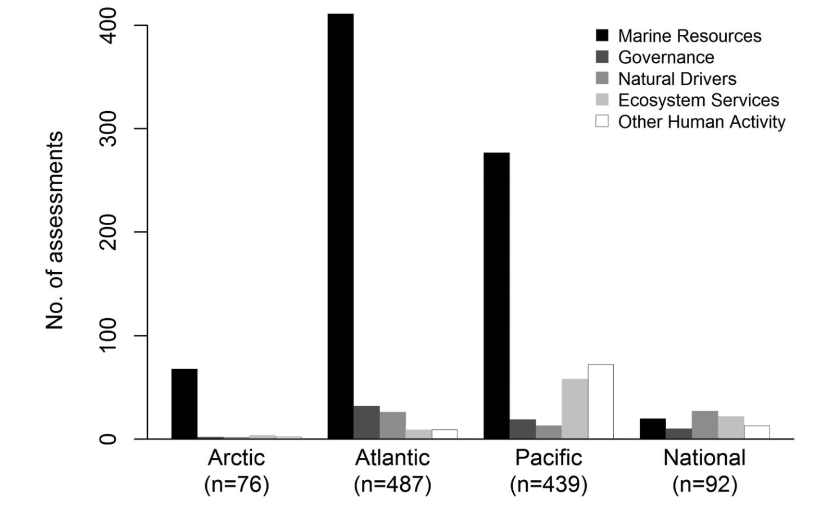

```{r packages and data, eval=T, echo=F, warning=F, message=F}

library(data.table)
library(dygraphs)
library(knitr)
library(dplyr)
library(ggplot2)
library(wordcloud) #For Word Mining
#install.packages('tm')
library(tm) #For Word Mining
library(pander)

data<- fread("/Users/jpalacios/Documents/Github/Meta_Data_Mexico/App_Esp/Template.csv",
             colClasses = c(Location = 'character',
                            Notes = 'character',
                            Data_Uncertanty ='character')
)
K_data<- read.csv("./Data/GLosario.csv",
                  header = TRUE,
                  na="NA")

x <- fread("/Users/jpalacios/Documents/Github/Meta_Data_Mexico/App_Esp/Data_Curve.csv")
x <- x %>%
  select(-1)
  
source('ts_fun.R')
  
  
```

<!-- ## Agenda {.emphasized} -->

<!-- >* Introducción -->
<!-- >* * Motivación -->
<!-- >* * Objetivos del proyecto -->
<!-- >* Estructura de la base de metadatos -->
<!-- >* Estado actual de la base -->
<!-- >* Resultados preliminares -->
<!-- >* Como colaborar -->

<!-- <div class="centered"> -->
<!-- <div class="red"> -->

<!-- >* En Andamiento | NO Datos | Invitación a Colaborar -->

<!-- </div> -->

<!-- ## Data Vs Metadatos -->

<!-- - **Datos:** "*Información sobre algo concreto que permite su conocimiento exacto o sirve para deducir las consecuencias derivadas de un hecho"* (RAE) -->

<!-- - **Metadatos:** es la información sobre cada aspecto de los datos que se requiere para entenderlo.  -->
<!--     - - Es decir: el ¿qué?, ¿Quién?, ¿cómo?, ¿cuándo?, etc. de los datos... -->

<!-- <div class="centered"> -->

<!--  -->


<!-- </div> -->

<!-- ## Motivación del proyecto -->

<!-- <div class="centered"> -->

<!-- >   -->

<!-- >  -->

<!-- *** -->

<!-- <div class="centered"> -->

<!--  -->

<!--  -->


<!-- *** -->

<!-- <div class="columns-2"> -->

<!--  -->

<!-- >- Aumento en la investigación multidisciplinaria -->

<!-- >- Biología, Ecología, Oceanografía, Economía, etc. -->

<!-- <div class="black"> -->

<!-- >- ¿Falta de datos? o ¿falta de disponibilidad de datos? -->

<!-- </div> -->
<!-- <div class="red"> -->

<!-- >- **Sin importar cuál sea, el resultado puede bloquear el progreso** -->

<!-- </div> -->
<!-- </div> -->

<!-- <div class="centered"> -->
<!-- <div class="green2"> -->


<!-- <div class="footer" style="margin-top:-200px;font-size:80%;"> -->

<!-- >- Una Base de metadatos fomenta la colaboración y apoya la toma de decisiones relevante a cualquier comunidad o región del país -->

<!-- </div> -->
<!-- </div> -->


## Objetivos del Proyecto

> - Diseñar la estructura de la base de metadatos de investigación relacionada con ecosistemas marinos y temas relacionados en México

<div class="green2">
> - **Identificar fuentes de datos disponibles e incorporar los metadatos de los mismos a la estructura**
</div>

> - Identificar tendencias en la disponibilidad de datos en México
> - Identificar vacíos de información que deberían ser tratados a futuro
> - Desarrollar protocolos para la publicación de la base de metadatos así como la incorporación de nuevos  registros

## Estructura de los Metadatos {.biger}

```{r Metadata display, eval=T, echo=F, warning=F,message=F}

 Title <- names(data)
kable(
  data.table(
  "Estructura" = Title[1:7],
  "Estructura" = Title[8:14],
  Estructura = Title[15:21],
  "Estructura" = Title[22:28]
),
col.names = NA
)

```

## Estado actual de la base

<div class="centered">


```{r Time line plot, eval=F, echo=F, warning=F,message=F, fig.align="center"}

xx <- ts(x,
         start=c(2016,11),
         end = c(2017,4), # <- this has to be changed everytime we add a month
         frequency= 12)

dygraph(xx) %>% #Creats the graph
  dyOptions(stackedGraph = TRUE, #Makes it stacked
            drawPoints = TRUE, #Shows each data point
            pointSize = 4) %>%
  #dyRangeSelector(height = 20) %>%
  dyAxis("x", drawGrid = FALSE) %>% #Removes the grid
  dyAxis("y", drawGrid = FALSE) %>%
  dyAxis("y", label = "Número de Registros") %>%  #Labels
  dyLegend(width = 400)

```

```{r Current Status, eval=T, echo=F, warning=F,message=F, fig.align="center"}

## Solid numbers ####
# Number of entries ####
Number_entries <- data %>%
  filter(MMID != "na")
Number_entriess <- paste(Number_entries$MMID[length(Number_entries$MMID)])

# Number of Data Points ####
Number_dp <- paste(sum(Number_entries$Data_Time_Points,na.rm=T))

# Number of Repositories ####
z<- data %>%
  group_by(Compilation_Title) %>%
  summarise(sum(Data_Time_Points)) %>%
  select(-2) %>%
  filter(!is.na(Compilation_Title)) %>%
  mutate(z = 1)

zz <- paste(sum(z$z))

```

<div class="green2">

>- Desde noviembre se han colectado: **`r Number_entriess`** registros, de **`r zz`** repositorios que equivalen a **`r Number_dp`** datos de investigación marina en México

</div>
</div>

## Fuentes de Información

```{r Info_Academia, eval=T, echo=F}

Aca <- data %>% 
  filter(Institution_Type=="Academic") %>% 
  group_by(Institution) %>% 
  summarise(n=n()) %>% 
  select(Institution)

kable(
  data.table(
  "Academicas" = Aca$Institution[1:6],
  "Academicas" = Aca$Institution[7:12]
),
col.names = NA,
align = "c"
)


```

***

```{r Info_Gobierno, eval=T, echo=F}

Gov <- data %>% 
  filter(Institution_Type=="GOV") %>% 
  group_by(Institution) %>% 
  summarise(n=n()) %>% 
  select(Institution)

kable(
  data.table(
  "Gobierno" = Gov$Institution[1:6],
  "Gobierno" = Gov$Institution[7:12]
),
col.names = NA,
align = "c"
)

```


## Resultados preliminares (Generales) {.smaller}

```{r Preeliminarya, eval=T, echo=F, warning=F,message=F, fig.width=9,fig.height=4.5, fig.align="center"}

Spp <- data %>% 
  filter(Area != "TBD") %>% 
  group_by(Area) %>% 
  summarise(Entradas = sum(n())) %>% 
  filter(Area !="na") # %>% 
# filter(Entradas >= input$Num_Data_Range[1]) %>% 
# filter(Entradas <= input$Num_Data_Range[2])

P1 <- ggplot(data= Spp,
       aes(
         x=reorder(Area, -Entradas),
         y=Entradas,
         fill=Area
       )) +
  geom_bar(stat="identity")+
  #coord_flip()+
  theme_classic() +
  ylab("Número de Registros")+
  xlab("Área")+
  theme(axis.text.x = element_text(hjust = 1,
                                   size=14,
                                   angle=45),
        axis.text.y = element_text(size = 14),
        legend.position = "none",
        axis.title = element_text(size=14,
                                  face="bold")
        
  )
Spp2 <- data %>%
  filter(Region != "TBD") %>% 
  group_by(Region) %>%
  summarise(Value = sum(n())) %>% 
  filter(Region != "na") %>% 
  filter(Region != "")

P2 <-ggplot(data= Spp2,
       aes(
         x=reorder(Region, -Value),
         y=Value,
         fill=Region
       )) +
  geom_bar(stat="identity")+
  theme_classic() +
  ylab("Número de Registros")+
  xlab("Región")+
  theme(axis.text.x = element_text(hjust = 1,
                                   size=14,
                                   angle = 45),
        axis.text.y = element_text(size = 14),
        legend.position = "none",
        axis.title = element_text(size=14,
                                  face="bold")
  )

gridExtra::grid.arrange(
  P1,
  P2,
  ncol = 2
)

```

***

```{r Research_field Particular, eval=T,echo=F,fig.width=9,fig.height=5, fig.align="c"}

SubjectPlot <- data %>% 
  filter(Research_Field == "Conservation") %>% 
  filter(!is.na(Area)) %>% 
  filter(Research_Field !="Other") %>% 
  filter(Region != "TBD") %>% 
  group_by(Subject_name,Region) %>% 
  summarise(Entradas = n())


```

Áreas de investigación


```{r Research_field, eval=T,echo=F,fig.width=9,fig.height=5, fig.align="c"}

Se_Plot <- data %>% 
  filter(!is.na(Area)) %>% 
  filter(!is.na(Research_Field)) %>%
  filter(Research_Field !="Other") %>% 
  filter(Area != "TBD") %>% 
  group_by(Area,Research_Field) %>% 
  summarise(Entradas = n())


ggplot(data=Se_Plot,
       aes(
         x=Area,
         y=Entradas,
         fill= Research_Field
       ))+
  geom_bar(stat = "identity")+
  theme_classic() +
  ylab("Número de\n registros")+
  xlab("Area")+
  theme(axis.text.x = element_text(
                                   size=14
                                   ),
        axis.text.y = element_text(size = 14),
        legend.position = "top",legend.text=element_text(size=16),
        axis.title = element_text(size=20,
                                  face="bold"))+ 
  guides(fill = guide_legend(title = "Research Field",
                             title.position = "left"))
```

***
Podemos hacer una reconstrucción de los datos generados en México en los últimos años.

<div class="centered">

<!-- NOTA CUANDO SEA EN PDF HAY QUE QUITAR EL COMENTARIO DEL LINK DE LA IMAGEN Y NO EVALUAR EL CHUNK -->


```{r Historic_Data, echo=F,eval=F}
Pedroche<- fread("/Users/jpalacios/Documents/Github/Meta_Data_Mexico/App_Esp/Pedroche_Hist.csv")
Pedroche <- Pedroche %>% 
  select(-1)
  
    
    Hist <- data %>%
      filter(MMID <=2861) %>%
      select(Start_Year,End_Year) # <- Temporary fix for Brusca and Pedroche data
    
    #Reads Predoche fixed data from the Parallel Analysis
    
    # #Join both datasets and removes NA's
    Fin_Plot <- Pedroche%>%
      bind_rows(Hist) %>%
      filter(!is.na(Start_Year))
    

    #Plots the Historic contribution
    ts_plot(Fin_Plot,1920,2020)

```    
    
## Palabras clave más frecuentes
    
También se puede utilizar para hacer exploración más cualitativa o para hacer comunicación.

```{r Keywords, eval=T, echo=F, warning=F,message=F, fig.align="center"}

Words <- data
WordsCorpus <- Corpus(VectorSource(Words$Keywords)) #Selects only Keywords
WordsCorpus <- tm_map(WordsCorpus,
                      PlainTextDocument) #Converts to plain text
WordsCorpus <- tm_map(WordsCorpus,
                      removePunctuation) #Removes punctuation

#Removes a word of user preference
# WordsCorpus <- tm_map(WordsCorpus,
#                       removeWords)
#

suppressWarnings(wordcloud(WordsCorpus, #Plots the words
                           max.words = 100,
                           random.order = FALSE,
                           colors=brewer.pal(8, "Dark2")
)
)

```


## Resultados preliminares (Particulares) {.smaller}

### El estado de la conservación en México

```{r Current Status particular, eval=T, echo=F, warning=F,message=F, fig.align="center"}

## Solid numbers ####
# Number of entries ####
Number_entries_Par <- data %>%
  filter(Research_Field == "Conservation") %>% 
  filter(MMID != "na") 

Number_entriess_Par <- paste(nrow(Number_entries_Par))

# Number of Data Points ####
Number_dp_Par <- paste(sum(Number_entries_Par$Data_Time_Points,na.rm=T))

# Number of Repositories ####
z<- data %>%
  filter(Research_Field == "Conservation") %>%
  group_by(Institution) %>%
  summarise(sum(Data_Time_Points)) %>%
  # select(-2) %>%
  # filter(!is.na(Compilation_Title)) %>%
  mutate(z = 1)

zz_Par <- paste(sum(z$z))


```


Registros: **`r Number_entriess_Par`**  Repositorios: **`r zz_Par`**  Datos: **`r Number_dp_Par`** 


```{r Preeliminar Particular, eval=T, echo=F, warning=F,message=F, fig.width=9,fig.height= 4.5, fig.align="center"}

Spp <- data %>% 
  filter(Research_Field == "Conservation") %>% 
  filter(Area != "TBD") %>% 
  group_by(Area) %>% 
  summarise(Entradas = sum(n())) %>% 
  filter(Area !="na") # %>% 
# filter(Entradas >= input$Num_Data_Range[1]) %>% 
# filter(Entradas <= input$Num_Data_Range[2])

P1 <- ggplot(data= Spp,
       aes(
         x=reorder(Area, -Entradas),
         y=Entradas,
         fill=Area
       )) +
  geom_bar(stat="identity")+
  #coord_flip()+
  theme_classic() +
  ylab("Número de Registros")+
  xlab("Área")+
  theme(axis.text.x = element_text(hjust = 1,
                                   size=14,
                                   angle=45),
        axis.text.y = element_text(size = 14),
        legend.position = "none",
        axis.title = element_text(size=14,
                                  face="bold")
        
  )

P1

```

***

### Número de Registros de Conservación por Región

```{r Preeliminar Particular2, eval=T, echo=F, warning=F,message=F, fig.width=9,fig.height=5, fig.align="center"}
Spp2 <- data %>%
  filter(Research_Field == "Conservation") %>% 
  filter(Region != "TBD") %>% 
  group_by(Region) %>%
  summarise(Value = sum(n())) %>% 
  filter(Region != "na") %>% 
  filter(Region != "")

P2 <-ggplot(data= Spp2,
       aes(
         x=reorder(Region, -Value),
         y=Value,
         fill=Region
       )) +
  geom_bar(stat="identity")+
  theme_classic() +
  ylab("Número de Registros")+
  xlab("Región")+
  theme(axis.text.x = element_text(hjust = 1,
                                   size=14,
                                   angle = 45),
        axis.text.y = element_text(size = 14),
        legend.position = "none",
        axis.title = element_text(size=14,
                                  face="bold")
  )

P2

```

***

```{r Campeche, eval=T, echo=F, warning=F,message=F, fig.width=9,fig.height=4.5, fig.align="center"}

Spp3 <- data %>%
  filter(Research_Field == "Conservation") %>% 
  filter(Region == "Banco Campeche Caribe") %>% 
  group_by(Institution,Location) %>% 
  summarise(Registros = n()) %>% 
  arrange(desc(Registros)) %>% 
  slice(1:10)

kable(Spp3)
  

```

***

Exploramos COBI


```{r COBI, eval=T, echo=F, warning=F,message=F, fig.width=9,fig.height=4.5, fig.align="center"}
Spp4 <- data %>%
  filter(Research_Field == "Conservation") %>% 
  filter(Region == "Banco Campeche Caribe") %>% 
  filter(Institution == "COBI") %>% 
  slice(c(1,509,1991)) %>% 
  select(2,5,10,11,12,14)

k<- kable(Spp4)

n_Spp <- data %>%
  filter(Research_Field == "Conservation") %>% 
  filter(Region == "Banco Campeche Caribe") %>% 
  filter(Institution == "COBI") %>% 
  group_by(Subject_name) %>% 
  summarise(n())


  

```

- **`r nrow(n_Spp)`** especies, registradas entre 2012 - 2016   
- Dos tipos de datos: **Abundancia y Talla**
- Para tres localidades: **Banco Chinchorro, Puerto Morelos y Sian Kaan**

`r k`

## CONABIO

```{r CONABIO_2, eval=T, echo=F, warning=F,message=F, fig.align="center", fig.width=9}

Sc <- data %>% 
  filter(Compilation_Title == "Catalogo de metadatos geograficos") %>%
  summarise(Registros=n(),Inicio = min(Start_Year), Fin = max(End_Year)) %>% 
  mutate(Mas_Registros ="Manglares")
  
```

**`r Sc$Registros[1]`** registros, desde `r Sc$Inicio[1]` hasta `r Sc$Fin[1]` siendo *`r Sc$Mas_Registros[1]`* los más repetidos

```{r CONABIO, eval=T, echo=F, warning=F,message=F, fig.align="center"}

Conabio <- data %>% 
  filter(Compilation_Title == "Catalogo de metadatos geograficos") %>%
  group_by(Area) %>% 
  summarise(Entradas = sum(n())) %>%
  ggplot(.,
       aes(
         x=reorder(Area, -Entradas),
         y=Entradas,
         fill=Area
       )) +
  geom_bar(stat="identity")+
  #coord_flip()+
  theme_classic() +
  ylab("Número de Registros")+
  xlab("Área")+
  theme(axis.text.x = element_text(hjust = 1,
                                   size=14,
                                   angle=45),
        axis.text.y = element_text(size = 14),
        legend.position = "none",
        axis.title = element_text(size=14,
                                  face="bold")
        
  )

Conabio2 <- data %>% 
  filter(Compilation_Title == "Catalogo de metadatos geograficos") %>%
  group_by(SE_Interaction) %>% 
  summarise(Entradas = sum(n())) %>%
  ggplot(.,
       aes(
         x=reorder(SE_Interaction, -Entradas),
         y=Entradas,
         fill=SE_Interaction
       )) +
  geom_bar(stat="identity")+
  #coord_flip()+
  theme_classic() +
  ylab("Número de Registros")+
  xlab("Interacciones Socio-Ecologicas")+
  theme(axis.text.x = element_text(hjust = 1,
                                   size=14,
                                   angle=45),
        axis.text.y = element_text(size = 14),
        legend.position = "none",
        axis.title = element_text(size=14,
                                  face="bold")
        
  )

gridExtra::grid.arrange(Conabio,Conabio2, ncol =2)
  

```


## Esfuerzo Colaborativo

<div class="columns-2">

>- 

>- **Informa:** Estamos buscando por cualquier fuente de datos relevante a los ecosistemas marinos en México.

>- **Difunde:** Parte del éxito de este proyecto depende de la cantidad de participantes involucrados y las distintas disciplinas que se logren reflejar

<div class="green2">
>- **No** estamos colectando datos si no que **Información** sobre los mismos
</div>

***

<div class="centered">
<div class="green2">

**¡Cuantas más personas participen, mejor podremos reflejar el estado de la investigación marina en México!**

</div>
</div>


## ¡Gracias!

<div class="centered">

- Juliano Palacios-Abrantes | j.palacios@oceans.ubc.ca
- Andres Cisneros-Montemayor | a.cisneros@oceans.ubc.ca

- **Colaboradores:**
Arreguín-Sánchez F, Cheung W. William, Cisneros-Mata Miguel A, Rodriguez Laura


Página del proyecto: https://jepa.shinyapps.io/marmetadatamexesp/

</div>

***
<div class="centered">


# ¿Preguntas?
