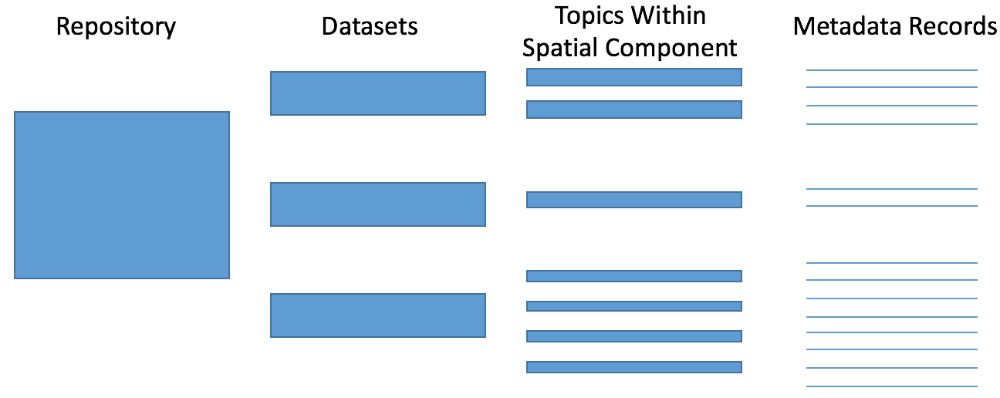

```{r setup, eval=T, echo=F, warning=F,message=F}

#Libraries 
library(dplyr)
library(knitr)
library(data.table)
library(ggplot2)
library(gridExtra)
library(dygraphs)
library(networkD3)

#Data needed

# Template (Updates from App)
Template <- fread("/Users/jpalacios/Documents/Github/Meta_Data_Mexico/App_Eng/Template.csv",
                 colClasses = c(Location = 'character',
                                Notes = 'character',
                                Data_Uncertanty ='character')
                 )

Time <- fread("/Users/jpalacios/Documents/Github/Meta_Data_Mexico/App_Esp/Data_Curve.csv")
Time <- Time %>%
  select(-1)
  
source('/Users/jpalacios/Documents/Github/Meta_Data_Mexico/App_Esp/ts_fun.R')

```

# Introduction

Climate change has been globally reshaping the marine ecosystem for the last century in different ways [Poloczanska, et al., 2013; Weatherdon et al 2016]. Increase on surface water temperature has been linked to both biomass change, and distribution shifts of marine fishes [Arreguín-Sánchez et al., 2016; Cheung et al., 2015]; coral bleaching on most reefs in the world [cita], and tropic mismatch in the water column [Edwards and Richardson, 2004]. Such effects are projected to continue and intensify if anthropocentric emissions are not mitigated [IPCC, william 1.5, Gatuso et al., 2015]. 

<!-- ### Link with human populations -->
These ecosystem change is already having repercussions on human populations, specially on those who directly relie on marine resources [Pershing et al., 2015; Weatherdon et al 2016]. Some coastal communities depending on fish have seen their catch change [Arreguín-Sánchez et al., 2016]; and global projections suggest it will continue to shift (Cheung et al., 20XX). This will impact coastal communities on both economic and food security aspects, particular those on developing nations [Lam et al., 2016; Vermeulen et al., 2014]. Climate change is also expected to reduce ecosystem services provided by already disturbed ecosystems like mangrove forests and coral reefs. Diminishing their mitigation efficiency, hence, increasing the risk of natural catastrophes in coastal communities [cita]

<!-- ### Why is it important for Mexico -->
These sociology-ecological relations are particularly important for coastal nations like Mexico. With over 11 thousand kilometers of coastline, Mexico's coast houses XXX families [INEGI]. Communities that live in the coast directly depend on landings for food [cita], coral reefs and marine protected areas for tourism [Alburto et al., 2011], and other ecosystem services [Lee et al., 2011; Palumbi et al., 2009]. It is essential that Mexico incorporates climate change to the political agenda in order to  foster adaptive capacity while incorporating sounding adaptation and mitigation plans [Mertz et al., 2009; Pershing et al., 2015; Rice and Garcia, 2011].

<!-- ### Talking about mitigation plans and Data -->
Adaptive capacity, as defined by the Intergovernmental Panel on Climate Change (IPCC) is the "The ability of a system to adjust to climate change (including climate variability and extremes) to moderate potential damages, to take advantage of opportunities, or to cope with the consequences." There are several research-based frameworks on climate change adaptation [cita]. Generally speaking, adaptation can be achieved in two non-exclusive ways: (i) building capacity among local communities to adjust, moderate and even take advantage of environmental changes and (ii) trough the implementation of policies that foster that adaptive process [Adger et al., 2005; IPCC, 2016]. In 2016 Mexico's government worked with the UNFCCC to produce a climate change adaptation strategy for mid-century [SEMARNAT-INECC, 2016]. This strategy is supported by the Climate Change Law (*Ley General de Cambio Climatico*) that serves as a framework for the development and implementation of public policies for  adaptation to climate change and the mitigation of greenhouse of gases [DOF, 2012].

The production and availability of natural and socio-economic data is a key component of the actions needed to achieve those goals [Mertz et al., 2009; Moser et al., 2010]. As a result, data availability has been identified as a common barrier in many steps of the adaptive management process, from the planning stage to outcome evaluation [Moser et al., 2010].  

In Mexico, numerous information covering the seas and coasts can be found in academic institutions (UNIMAR; UCSD) and NGOs (COBI; TNC) located (physically) both inside and outside the country, as well as government agencies (CONABIO; CONAPESCA). However, there is an overall assumption that in developing nations data are often limited and perceived as lacking [cita]. In many cases, this is largely a result of the lack of knowledge about the availability of these data, rather than a complete (or partially) lack of it [cita]. Data availability is key not only to better understand Mexico's marine and coastal environments, but to identify knowledge gaps so that research can be prioritized [Reichman et al., 2011]. This will facilitate furnishing management and conservation policies for marine resources and coastal habitats vulnerable to climate change. 

<!-- ### Metadata  -->
Management of data and metadata (the information about every aspect of the data that is required to understand it) is a huge step to ensure proper preservation, stewardship, and access to information [Michener et al., 1997; Vincent et al., 2010]. And while diverse barriers often compromise the exchange of data among stakeholders [Reichman et al., 2011], having publicly accessible description on existing data (and metadata) is a huge step towards increasing collaboration for innovative research [Michener et al.,m 2006]. Having proper metadata increases data longevity, foster collaboration, and help examine analysis of the data itself; all important aspect of climate change studies [Michener et al., 2006]. The standardization of information trough metadata specifications provide guidance for consistently describing data objects and data types (e.g., methods, units of measurement, and details of experimental design) [Reichman et al., 2011]. Moreover, it allows the creation of a catalog that holds data or information of different disciplines. Countries like Canada have recently created nation-wide repositories of marine-related research metadata [Cisneros-Montemayor, 2016]. 

Several initiatives in different levels of society in Mexico are currently working on grouping data-sets and information in single repositories. University level projects like The Gulf of Mexico Species Interactions database [GoMexSI] and DataMares [DataMares] are collecting information from specific areas (the gulfs of Mexico and California, respectively). Non-governmental organizations are also contributing with initiatives like MonitoreoNoroeste that focus on marine monitoring data [FMCN]. Finally, the National Commission for the Knowledge of Biodiversity (CONABIO) hold an important and robust list of biological and social data related to both marine and terrestrial environments [CONABIO]. Moreover, as part of a cutting-edge initiative, Mexico has recently created an information system solely devoted to climate change [SICC].

<!-- ### What we actually did -->

These initiatives are examples of successful efforts to make marine data in Mexico available. However, there is still a lot of work to do. Most of the repositories available cover geographic areas or are topic specific. Those that are actually nation-wide are often limited or also topic-specific. Hence, the current project aimed to create a meta-database for oceanographic, ecological, economic, fisheries and social data for marine ecosystems and marine-related sectors of Mexico. The information collected was then analyzed in order to determine trends and data gaps in Mexico. Finally, using fisheries as an example we **somehow** evaluated Mexico's position in relation to climate change data and identified fields of improvement. It is worth mention that the meta-database is an open source repository for public consultation and sharing. We believe that the meta-database of marine research will help facilitate efficient use of existing information and stimulate collaboration among multiple stakeholders. 

 
# Materials and Methods
```{r Repositories_Institutions, eval=T, echo=F, warning=F,message=F}

#Number of Repositories ####

 Compi<- Template %>% 
      group_by(Compilation_Title) %>% 
      summarise(z=n()) %>% 
      select(-2) %>% 
      filter(!is.na(Compilation_Title))

# Main repositories
M_Repo <- slice(Compi, 1:5)

# Repos by 
Type_Repo<- Template %>% 
      group_by(Institution_Type) %>% 
      summarise(Suma = n()) %>% 
      filter(!is.na(Institution_Type)) %>% 
      mutate(z = 1) %>% 
  arrange(Institution_Type)

# Institutions #

Insti<- Template %>% 
      group_by(Institution) %>% 
      summarise(z=n()) %>% 
      select(-2) %>% 
      filter(!is.na(Institution))
    

# En Texto #
Inst <- nrow(Insti)
Repo <- nrow(Compi) # Numero total de repositorios
SE <- unique(Template$SE_Interaction) # SE clasifications
Main_Repo <- unique(M_Repo$Compilation_Title)


```

## Data Compilation

The first step towards building the meta-database was the selection of categories in witch data was going to be categorized. This step was crussial for the subsequent meta-analysis of the diffeent aspects of marine research in Mexico. The present effort concentrated in collecting information on data related to marine systems in Mexico from biology, ecology, fisheries, oceanography and social sciences. Because digital-available data in Mexico is scattered among different types of institutions, we started the search on global assessments (e.g. OBIS, FAO, NOAA, etc.) and subsequently went for more local data sources (e.g. Mexican universities catalogues, NGOs databases, etc.). While plenty information was found on these online sources, it was suspected that many of the metadata created was going to be found on personal off-line repositories (e.g. Long-track researchers, local ressources managers and NGOs). For this last step we organize **seven** different workshops/meetings in **five** marine-research hubs cities of Mexico. Hoping to collect information from top researchers we participated on **four** key academic events (EDF Mexico Meeting on Fisheries, 2017; State of the Gulf of Mexico, 2017; Sustainable Aquatic Ressources Workshop Mexico, 2017; International Meeting for Usage and Conservation of Fisheries Ressources, 2017). Because this is a collaborative initiative, we also partner up with other initiatives (e.g. DataMares, MonitoreoNoroeste, CONABIO, etc.) to have their data represented in the meta-dataset.

## Metada Structure

Each record on the meta-dataset is part of a specific dataset included on a repository related to coastal and marine resources or regions. We first split each dataset found in the repository and then each topic represented in such dataset. Hence, each record in the meta-database represents a topic included in a dataset **(Figure 1)**. For biological data the topics were applied for each species (or group of species). Lastly, when the information had a spatial content, the information was disaggregated to the level of municipality. This dessagrageted method of including information creates a longer dataset but allows for a more specific type of meta-analysis. 

The metadata gathered was categorized in 7 braod categories: 




## Data Sources

The current effort to build the metadata collected data from `r Repo` repositories gathered by `r Inst` national and international institutions. The type of institutions included in this effort were academic (**n** = `r Type_Repo[1,2]`), gouvernamental agencies (**n** = `r Type_Repo[3,1]`), **inter** (`r Type_Repo[3,1]`) and **non** (**n** = `r Type_Repo[5,1]`) gouvernamental agencies, and international data sources (**n** = `r Type_Repo[4,1]`).


## Case study 1: Climate change data availlabillity

## Case study 2: Marine Protected Areas and somehting else in Mexico

# Results

```{r Results, eval=T, echo=F}

# Number of metadata registers    
Registers <- round(
  Template$MMID[length(Template$MMID)]/1000,
  1)

# Number of Data Points ####
Data_Points <- round(
  sum(Template$Data_Time_Points,na.rm=T)/1000,
  1)

#Number of Repositories ####
 z<- Template %>% 
      group_by(Compilation_Title) %>% 
      summarise(sum(Data_Time_Points)) %>% 
      select(-2) %>% 
      filter(!is.na(Compilation_Title)) %>% 
      mutate(z = 1)
    
Repo <- sum(z$z)

#Disciplines (Sociology. eg.)
Dis <- Template %>% 
  group_by(Research_Field) %>% 
  summarise(n=n(),
            DP=sum(Data_Time_Points,
                  na.rm =T)) %>%
  mutate(Rate = round(
    DP/n,
    2)) %>% 
  arrange(desc(Rate))
# Dis by data point #


#### Species Information ####

Species <- Template %>%
  filter(Subject_name !="TBD") %>% 
  filter(Subject_name != "Multiple Especies") %>%
  filter(Subject_name != "Multiple Species") %>% 
  group_by(Subject_name) %>% 
  summarise(x=n()) %>% 
  arrange(-x)

#### Histograms ####

Hist_S <- filter(Species, x >= 20)

#hist(Hist_S$x)

###

Mean <- round(
  mean(Species$x,na.rm = T),
             2)
SD <- round(
  sd(Species$x,
             na.rm = T),
  2
)

#### In Text Results ####

Dis_n <- Dis %>% 
  arrange(desc(n))

```

## General Numbers

The meta-database of marine research has `r Registers` thousand records containing information for about `r Data_Points` thousand data points. The research field with the most amount of records found was **`r Dis_n[1,1]`** (**n** = `r Dis_n[1,2]`), followed by **`r Dis_n[2,1]`** (**n** = `r Dis_n[2,2]`) (Figure 1). However, when we analize the amount of data points by each register, we find that  **`Dis[1,1]`** (**n** = `r Dis[1,4]`) and **`r Dis[2,1]`**( **n** = `r Dis[2,4]`) have the higher rate of data-points per register.

```{r Fig1, eval=T, echo=F, fig.align="center",fig.height=4,fig.width=7,fig.cap="Number of data points per research field."}

P1 <- Dis %>% 
  ggplot(.,
             aes(
               x=reorder(Research_Field, 
                         -DP),
               y=DP/1000, #Thousand
               fill=Research_Field
             )) +
        geom_bar(stat="identity")+
        #coord_flip()+
        theme_classic() +
        ylab("Registers (Thousand)")+
        xlab("Research Field")+
        theme(axis.text.x = element_text(hjust = 1,
                                         #size=11,
                                         angle=45),
              # axis.text.y = element_text(size = 11),
              legend.position = "none")
              # axis.title = element_text(size=12)
        # )

P2 <- Dis %>% 
  ggplot(.,
             aes(
               x=reorder(Research_Field, 
                         -Rate),
               y=Rate,
               fill=Research_Field
             )) +
        geom_bar(stat="identity")+
        #coord_flip()+
        theme_classic() +
        ylab("Registers (Thousand)")+
        xlab("Research Field")+
        theme(axis.text.x = element_text(hjust = 1,
                                         #size=11,
                                         angle=45),
              # axis.text.y = element_text(size = 11),
              legend.position = "none")
              # axis.title = element_text(size=12)
        # )

grid.arrange(P1,
             P2,
             nrow =2)

```

There is a total of `r nrow(Species)` subjects in the metadata. The subject that has the most amount of data points is `r Species[1,1]` with `r Species[1,2]` registers However, at the species level,* Ophiactis savignyi* is the most repeated one with `r Species[33,2]` records. The data distribution is very diverse since the mean data point is `r Mean` (sd `r SD`). This is mainly because a large amount of records are one observation of species lists.


```{r Geographic, echo = F, eval= T}

#Geo Area#
Geo <- Template %>% 
        group_by(Area) %>% 
        summarise(Entradas = sum(Data_Time_Points,na.rm=T)) %>% 
        filter(Area !="na") %>% 
        filter(Area != "TBD") 

Pacific <- Geo %>% 
  filter(Area =="Pacific")

Atlantic <- Geo %>% 
  filter(Area =="Atlantic")

#Geo Region#
Geo_R <- Template %>% 
        group_by(Region) %>% 
        summarise(Entradas = sum(Data_Time_Points,na.rm=T)) %>% 
        filter(Region !="NA") %>% 
        filter(Region != "TBD") %>% 
  arrange(desc(Entradas))

GC_R <- Geo_R %>% 
  filter(Region =="G. Of California")

BC_R <- Geo_R %>% 
  filter(Region =="B. Camp. Caribe")
      
```

## Geographic Analysis
In terms of regional data distribution, data points where evenly distributed between both the Pacific (`r Pacific[1,2]`) and the Atlantic oceans (`r Atlantic[1,2]`). However, the great majority of data points are reported at a National level (`r Geo[1,2]`). At a more detailed level we find that there is a clear dominance of data from both the Gulf of California (`r GC_R[1,2]`) and the Campeche Bank (`r BC_R[1,2]`), in respect to the other zones determined by the working group.

```{r Fig2, eval=T, echo=F, fig.align="center",fig.height=9,fig.width=9,fig.cap="OPTION 1. Number of data points per geographic area for each research field."}

#### Area ####

Geo_Plot <- Template %>% 
        group_by(Area,Research_Field) %>% 
        summarise(Entradas = sum(Data_Time_Points,na.rm=T)) %>% 
        filter(Area !="na") %>% 
        filter(Area != "TBD") 

Area_PLot <- ggplot(data= Geo_Plot,
             aes(
               x=reorder(Area, -Entradas),
               y=Entradas,
               fill=Research_Field
             )) +
        geom_bar(stat="identity")+
        #coord_flip()+
        theme_classic() +
        ylab("Data Points")+
        xlab("Area")+
        theme(axis.text.x = element_text(hjust = 1,
                                         angle=45),
                                         # size=11,),
              # axis.text.y = element_text(size = 11),
              legend.position = "none")
              # axis.title = element_text(size=11))

#### Region ####

Reg_Plot <- Template %>% 
        group_by(Region,Research_Field) %>% 
        summarise(Entradas = sum(Data_Time_Points,na.rm=T)) %>% 
        filter(Region !="na") %>% 
        filter(Region != "TBD") 

Region_Plot <- ggplot(data= Reg_Plot,
             aes(
               x=reorder(Region, -Entradas),
               y=Entradas,
               fill=Research_Field
             )) +
        geom_bar(stat="identity")+
        #coord_flip()+
        theme_classic() +
        ylab("Data Points")+
        xlab("Region")+
        theme(axis.text.x = element_text(hjust = 1,
                                         angle=45) ,
                                         # size=11,),
              # axis.text.y = element_text(size = 11),
              legend.position = "none")
              # axis.title = element_text(size=11))

#### Location ####

Loc_Plot <- Template %>% 
  filter(Location !="na") %>% 
  filter(Location != "TBD") %>% 
  filter(Location != "Multiple locations") %>% 
  filter(Location != "Multiple") %>% 
  group_by(Location,Research_Field) %>% 
  summarise(Entradas = sum(Data_Time_Points,na.rm=T)) %>% 
  arrange(
    desc(
      Entradas
      ),
          Research_Field) %>% 
  head(10)

Location_Plot <- ggplot(data= Loc_Plot,
             aes(
               x=reorder(Location, -Entradas),
               y=Entradas,
               fill=Research_Field
             )) +
        geom_bar(stat="identity")+
        #coord_flip()+
        theme_classic() +
        ylab("Data Points")+
        xlab("Top 10 Localities")+
        theme(axis.text.x = element_text(hjust = 1,
                                         angle=45) ,
                                         # size=11,),
              # axis.text.y = element_text(size = 11),
              legend.position = "top")
              # axis.title = element_text(size=11))

#### Resolution ####

Spat_Res <- Template %>% 
  filter(Location !="na") %>% 
  group_by(Spatial_Resolution,Research_Field) %>% 
  summarise(Entradas = sum(Data_Time_Points,na.rm=T))

Spatial_Res <- ggplot(data= Spat_Res,
             aes(
               x=reorder(Research_Field,
                         -Entradas),
               y=Entradas,
               fill=Spatial_Resolution
             )) +
        geom_bar(stat="identity")+
        #coord_flip()+
        theme_classic() +
        ylab("Data Points")+
        xlab("Spatial Resolution")+
        theme(axis.text.x = element_text(hjust = 1,
                                         angle=45) ,
                                         # size=11,),
              # axis.text.y = element_text(size = 11),
              legend.position = "top")
              # axis.title = element_text(size=11))

grid.arrange(Area_PLot,
             Region_Plot,
             Location_Plot,
             Spatial_Res,
             ncol =2
)
                                        
```


```{r Network_Analysis, echo=F,eval=T}


# Por ahora este funciona ya que hay que limpiar los metadatos

DFb <- read_csv("~/Documents/Github/Meta_Data_Mexico/Manuscript/Try_I.csv", 
    col_types = cols(Value = col_number()))

sankeyNetwork(Links = DFb, Nodes = DFb, Source = "Source",
             Target = "Target", Value = "Value", NodeID = "Name",
             fontSize = 12, nodeWidth = 30)


# Eventualmente...
# 
# 
# # Name for each category of the graph
# Category <- data.table::data.table(Name=c("Academic",
# "Goverment_Fund",
# "Inter. Gov (IGO)",
# "International",
# "Non. Gov. (NGO)",
# "Private",
# "Aquaculture",
# "Conservation",
# "Ecology",
# "Fisheries",
# "Oceanography",
# "Sociology",
# "Turism",
# "Other",
# "Goverment_Res."
# )
# )
# 
# # The rest of the needed information
# 
# R_Fund_Org <-Template %>%
#   filter(!is.na(Research_Fund)) %>%
#   group_by(Research_Fund,Institution_Type) %>%
#   summarise(Value =n()) %>%
#   slice(-1) %>%
#   rename(Source = Research_Fund,
#          Target = Institution_Type)
# 
# Inst_Field <-Template %>%
#   filter(!is.na(Institution_Type)) %>%
#   group_by(Institution_Type,Research_Field) %>%
#   summarise(Value = n()) %>%
#   rename(Source = Institution_Type,
#          Target = Research_Field) %>%
#   bind_rows(R_Fund_Org) %>%
#   slice(-1)
# 
# Inst_Field$Source <- as.numeric(as.factor(Inst_Field$Source))
# Inst_Field$Target <- as.numeric(as.factor(Inst_Field$Target))
# 
# sankeyNetwork(Links = Inst_Field, Nodes = Category, Source = "Source",
#              Target = "Target", Value = "Value", NodeID = "Name",
#              fontSize = 12, nodeWidth = 30)

```

# Discussion
# Literature Review