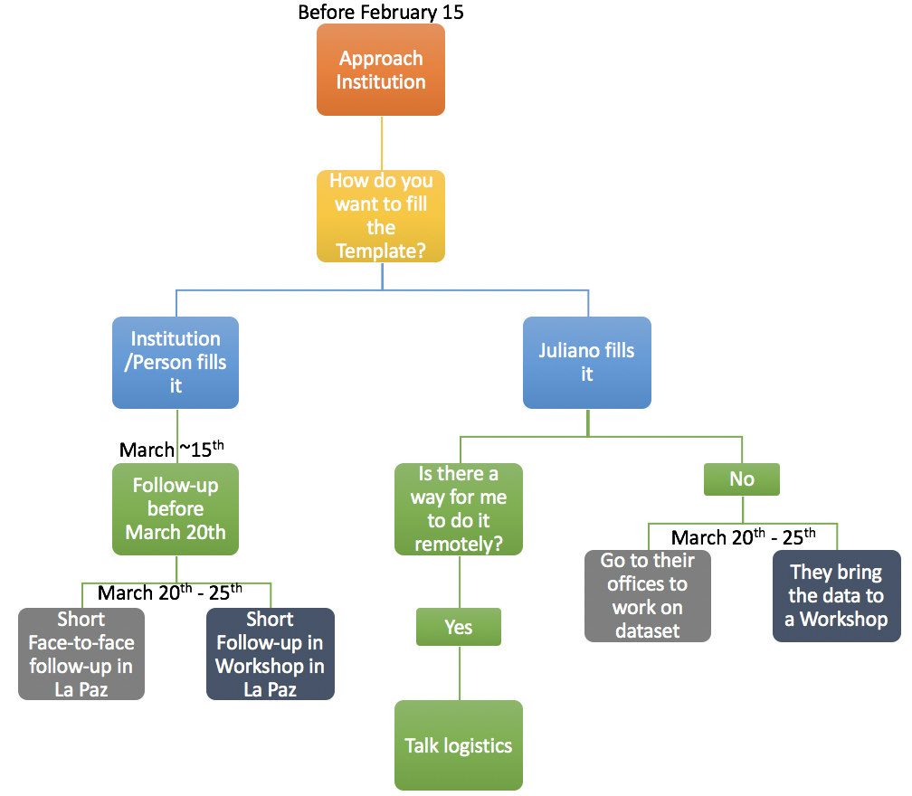

The objective of these working sessions are to gather the most amount of information possible. Ideally, I would go to La Paz to gather data rather than convince people to collaborate with the project. I don't know how (economically and logistically) viable is to do this in each of the places we identified (La Paz, Ensenada, Guaymas, Mexico City, Merida and Oaxaca). But La Paz should work as a proxy of how complicated gather data will be. Hopefully we can optimize time and come out with a strategy that allows us to rapidly gather data.  

Also, I will have a remote session with the LAFF master students of UCSB on February 20th. My objective will be to evaluate how hard is for them to input data on the Template remotely. This will give us a better idea of how essential it is for me to actually be collecting data (at least from a technical point of view).

## Dates

The idea is to take advantage of the North American Association of Economist Forum [**(NAAFE)**](https://www.xcdsystem.com/naafe/website/) in La Paz and have the workshop at the same time. Since the Economics meeting is from the 22-24, the possible dates for me to be in La Paz would be between March 20th and 24th.

This is a great time not only because Andres will also be there but because some of the important people we've identified will probably attend.

## Key Institutions and People in La Paz

#### Academia
- Arturo Bocos, UABCS
- Hector Reyes-Bonilla, UABCS 
- CIBNOR, identify key researchers of the institution (**Paco?**)

#### Gouverment
- One or two key researchers from the CRIP La Paz? (**MAC**)

#### NGO's
- Niparaja, Amy Hudson
- COBI-la Paz, **No contact**
- The Nature Conservancy, Diana Bermudez
- WWF, Enrique Sanjurjo
- Fondo Mexicano para la Conservación de la Naturaleza-La Paz, Rocío Rivera

#### Participants of the Meeting
Andres, do you think you could talk with the people attending the meeting? If I understand correctly you have good relationships with many of them? In that case we could contact them and see if they would agree on sharing the information at some point that week.

## Tentative Apporach

#### Before La Paz, BCS

First step should be contacting those institutions and researchers that we have identified on the "Red" spreadsheet (Attached on the email) and set a meeting with those that need further explanation of the project (See the image below for a general flow chart). From that meeting, there are two paths to follow:

1. **They want to fill the Template themselves** In this case I would instruct them on how to input data. I can set follow-up calls/e-mails to "supervise" the process. Finally I will try to have a meeting in La Paz to speed up the process. Hopefully we will have a good idea of what works and what doesn't from the LAFF exercise.

2. **I am the one filling in the Template.** Then we will have to figure out the logistics for that. I don't think people will share their data so I will probably have to sit with them in La Paz and gather the most amount of info possible. If they send me their data then we have no problem. We can also try to identify the "specifics" of their data and work from there.

#### In La Paz, BCS

Once in La Paz, we can follow two options (or a combination of both):

1. **Working sessions.** We could have multiple working sessions over the week where people can show up and work on the Template. This will make our life easier since I could be helping more than one person at a time (Andres could also participate, depending of his agenda).

2. **Face-to-face interactions.** Instead of having the workshop sessions I would set meetings during those days with the most amount of people possible. I would then sit people to work on the Template and hopefully capture all their data.

3. **Combination of both** I can visualize some people preferring to have face-to-face interactions. Specially those institutions with plenty of data that will probably take more than a couple of hours to collect. We can ask, in the initial conversation how mutch different data do they have, how is stored, and so on, to try to estiate the time it will take to gather the information.

